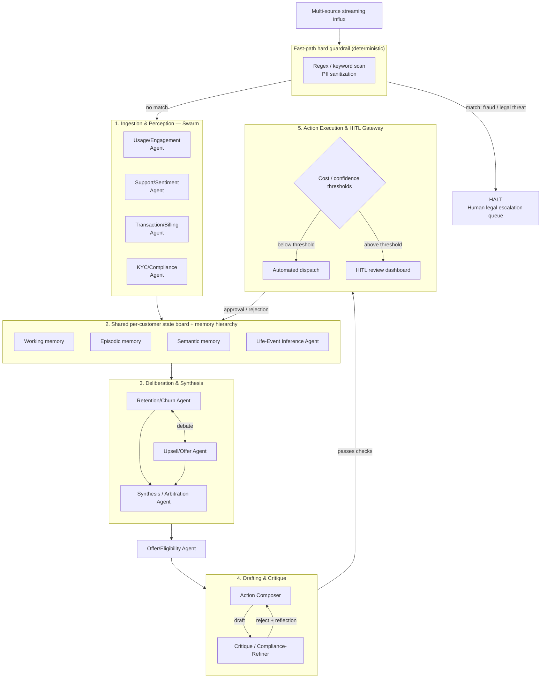

# Agentic Customer 360 — Proactive Intervention Desk

This repository contains my implementation of the "Agentic Customer 360" problem for the Inter IIT Tech Meet 15.0 / Prepathon 2026.

## 1. What This Project Is

This project is a multi-agent system designed to ingest banking events, infer customer life events, and proactively recommend interventions. It monitors streaming data (transactions, support tickets, KYC updates) and maintains an evolving understanding of the customer to execute timely, cost-aware actions.

## 2. The Problem Being Solved

Banks have vast amounts of data about their customers, but it's siloed. Recognizing that a customer is entering financial distress or having a child requires correlating signals across different systems. The goal is to build an intelligent engine that does this correlation proactively, securely, and transparently, rather than waiting for a customer to complain.

## 3. Why a Normal Chatbot Architecture is Not Appropriate

I explicitly decided against a monolithic chatbot architecture. A standard chatbot waits for user prompts, but this system must be ambient—reacting to events asynchronously. Furthermore, flattening every decision into a single LLM call is prone to context poisoning, hallucinations, and makes hard compliance rules difficult to enforce. 

## 4. Overall Architecture

I implemented a tiered pipeline based on my research. For a complete deep dive into every structural component and the dataset evaluation results, please see the [Architecture & Results Deep Dive](docs/architecture_and_results.md).

The architecture is as follows:



## Research and Architectural Decisions

I formulated my approach based on several key papers:

*   **MemGPT**: I used the main-context/external-context distinction to structure working and episodic memory. This keeps the active context clean while retaining long-term history.
*   **Generative Agents**: I used recency, importance, and relevance instead of similarity-only memory retrieval. An important but older event shouldn't be crowded out by a recent trivial one.
*   **Anthropic Building Effective Agents**: I used different coordination patterns for different stages rather than one topology everywhere.
*   **Multi-agent debate**: I kept debate scoped to Retention vs Upsell instead of using it as a generic disagreement mechanism. This forces genuine opposition only where useful.
*   **Reflexion**: I store structured rejection/reflection information from failed action drafts, preventing loops.
*   **Uber / DoorDash**: I treated streaming feature freshness as an actual engineering requirement, processing events chronologically.
*   **Streaming RAG**: I treat stale retrieval as a real failure mode, ensuring eligibility constraints are dynamically checked.
*   **Constitutional AI**: I used the idea of explicit written criteria for critique/refinement, while keeping hard-stop safety outside the LLM.

*(Note: I was still reading GPTSwarm and multi-agent memory consistency literature, so I kept the ingestion swarm as a flat fan-out for now rather than a complex dependency graph).*

## Scoring Harness

I built an evaluation harness to grade the trajectories.
When the ground truth `q` is one-hot, KL divergence reduces to cross entropy, so I treat cross entropy as the primary probabilistic classification metric. 
The harness also evaluates:
*   State prediction accuracy (F1, Precision, Recall)
*   Timeliness (Detection delay, time-to-confidence)
*   Action Quality (Appropriate routing, cost bounds)

## How to Run

Install dependencies (if any):
```bash
pip install pydantic scikit-learn
```

Run a scenario (e.g. scenario_01):
```bash
python main.py --scenario customer_360_dataset/scenario_01
```

Run evaluation:
```bash
python main.py --scenario customer_360_dataset/scenario_01 --evaluate
```

## Implemented vs Future Work
**Fully Implemented**:
* Deterministic guardrails
* Event ingestion loop
* Swarm feature extraction
* State board architecture
* Routing logic / HITL emulation
* Evaluation harness

**Partially Implemented**:
* Mock LLM layer (Abstracted `LLMProvider` is ready to plug into real API).
* Scoped Debate is logically mapped but running in mock resolution mode.

**Future Work**:
* Integrating real API keys for production RAG and true semantic parsing.
* Tuning the memory decay half-life empirically.
