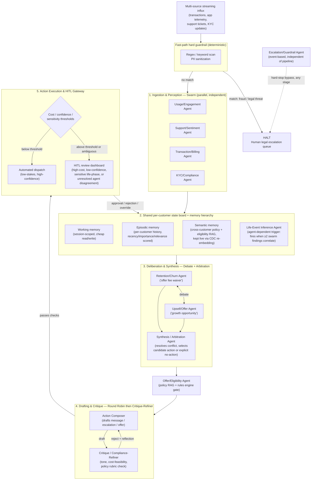

# Preliminary System Architecture — Agentic Customer 360

**Status:** Preliminary (mid-term). This document is the architectural companion to `01_research_log.md` — every non-obvious choice below links back to a numbered entry in that log. It will be revised before end-term as implementation surfaces constraints the diagram doesn't yet show.

## 1. Design summary

The system is a five-stage pipeline sitting behind a single hard-guardrail fast path. Each stage uses the coordination pattern best suited to what it's actually doing (Research Log §2.1), not one topology applied uniformly:

| Stage | Pattern | Why |
|---|---|---|
| Ingestion | Swarm (parallel, independent) | Usage, Support, Transaction, KYC signals are genuinely independent at collection time — no agent needs another's output to do its own job. |
| Correlation | Agent-dependent handoff | Life-Event Inference only fires once two or more swarm findings cross a joint threshold — a derived trigger, not a raw one. |
| Deliberation | Debate (scoped) + arbitration | Retention and Upsell agents can hold genuinely opposed, evidence-grounded positions on the same customer; a separate Arbitration Agent resolves rather than either debater self-judging. |
| Drafting & safety | Round robin, then Critique-Refiner | Tone, factual grounding, and compliance each need a dedicated pass on the same draft before it can reach a human. |
| Execution | Rule-based routing to Automated Dispatch or HITL | Deterministic, not learned — cost/confidence/sensitivity thresholds decide the branch, not an LLM. |

## 2. Diagram

*Rendering note:* GitHub renders Mermaid natively in Markdown; a static PNG export will be added alongside this file for the final submission per PS §7.3, generated from this same source so the two never drift apart.

## 3. Component-by-component notes

### 3.1 Fast-path hard guardrail
Deterministic regex/keyword/classifier match, no LLM in the loop. This is intentionally the *only* component in the diagram that is not an agent — Research Log §4.1 is the reason: soft, LLM-critiqued safety is not an acceptable substitute for a hard stop on legal-threat or fraud-pattern language. It runs before ingestion and is also reachable directly from the Escalation/Guardrail Agent later in the pipeline (dashed line), because a hard-stop condition (e.g., a customer escalating to legal mid-conversation) can appear at any stage, not only at intake.

### 3.2 Ingestion & Perception (swarm)
Usage/Engagement, Support/Sentiment, Transaction/Billing, and KYC/Compliance agents run independently against the same event stream and write only structured conclusions to the state board (e.g., `login_frequency_trend: -40%, confidence: high`) — never their raw chain-of-thought and never each other's internal reasoning trace. This scoping choice is deliberate: it is what keeps handoffs clean per PS §4.1 and prevents one agent's context from polluting another's, the exact failure mode illustrated in the PS's "poisoned context window" situation.

### 3.3 Shared state board & memory hierarchy
Three tiers, matching Research Log §1.1–1.2:
- **Working memory** — this session's open case only; cheap, discarded or compressed on resolution (MemGPT's "main context" analogy).
- **Episodic memory** — per-customer history of interventions, flags, and outcomes, retrieved by a weighted recency/importance/relevance score rather than similarity alone (Generative Agents' retrieval formula), so an 18-month-old churn flag doesn't outweigh last week's signal by default.
- **Semantic memory** — cross-customer policy, eligibility rules, and compliance RAG base, kept live via change-driven re-embedding rather than scheduled reindexing (Research Log §3.3), because a stale eligibility rule is a compliance risk, not just an accuracy one.

The Life-Event Inference Agent is drawn inside the board rather than as a pipeline stage because its output — "this customer is likely in a home-purchase phase, confidence: medium" — is meant to be read by multiple downstream agents over multiple weeks, not consumed once and discarded (this is the PS's standing goal in §3, and the reason it's treated as persisted state rather than a one-shot classifier output).

### 3.4 Deliberation & Synthesis (debate, scoped)
Retention/Churn and Upsell/Offer agents are prompted as advocates for opposing recommendations grounded in the same evidence, not as neutral analysts who happen to disagree — per Research Log §2.2, softening this into "just answer honestly" would remove the Degeneration-of-Thought resistance the pattern exists to provide. A separate Synthesis/Arbitration Agent — not either debater — decides the candidate action, including the explicit "both signals are true, treat as a growth customer" resolution the PS calls out as the value of surfacing disagreement instead of averaging it away.

### 3.5 Offer/Eligibility gate
A deterministic rules-engine + policy-RAG check that a candidate action is even legally/contractually offerable before any drafting effort is spent on it. Placed after arbitration and before drafting so ineligible offers are filtered cheaply rather than critiqued expensively later.

### 3.6 Drafting & Critique (round robin → critique-refiner)
The Action Composer drafts a message/escalation/offer; the Critique/Compliance-Refiner checks it against an explicit written rubric (cost ceiling, tone, compliance clauses — the constitution-as-rubric pattern from Research Log §4.1) and returns either a pass or a natural-language rejection reason. Rejections are stored as structured reflections against the customer's episodic memory (Research Log §2.3), not just a boolean, so a similar future draft doesn't repeat the same mistake.

### 3.7 Action Execution & HITL Gateway
A deterministic threshold check — not an LLM judgment call — decides automated dispatch vs. human review. Escalation triggers on cost, on low confidence, *and* on unresolved agent disagreement, independent of dollar amount, matching PS §6.3's requirement that ambiguity routes to a human even when the cost is low. Every HITL decision (approve/reject/modify) writes back into the state board as episodic memory, closing the loop the PS describes as the system "earning trust over time."

### 3.8 Escalation/Guardrail Agent
Deliberately drawn outside the main flow with a dashed connection to the hard-stop halt. It is event-based and scans independently of pipeline stage, so a legal threat arriving mid-draft (not just at intake) still triggers an immediate bypass — this addresses the PS's requirement that guardrails be "physically impossible... to execute" around, which a guardrail embedded only at the ingestion stage would not guarantee.

## 4. Trigger types used, by agent

| Agent | Trigger type | Fires when |
|---|---|---|
| Usage/Engagement | Event + time-based | Each usage event; daily rollup |
| Support/Sentiment | Event-based | New ticket or message |
| Transaction/Billing | Event-based | Real-time transaction stream |
| KYC/Compliance | Event + time-based | KYC update; periodic re-verification |
| Life-Event Inference | Agent-dependent | ≥2 swarm agents flag correlated anomalies in the same window |
| Synthesis/Arbitration | Agent-dependent | Swarm findings published to board |
| Offer/Eligibility | Agent-dependent | Synthesis produces a candidate opportunity |
| Action Composer / Retention | Agent-dependent | Synthesis + Eligibility agree there's a case |
| Critique-Refiner | Agent-dependent | Immediately after a draft is composed |
| Escalation/Guardrail | Event-based | Hard-stop keyword/pattern match, any stage |

## 5. Open design questions — my current (preliminary) answers

These are the three questions the PS flags as ones we "must answer, not assume." My current answers, to be pressure-tested during implementation:

1. **When is a past episodic memory relevant vs. noise?** We use the recency-importance-relevance weighted score from Generative Agents rather than a hard recency cutoff, so an important but older event (e.g., a past fraud hold) isn't dropped just because it's not recent, but an old, low-importance ticket is naturally deprioritized.
2. **How do we prevent memory bleed-through across customers at scale?** Every state-board read/write is scoped by a mandatory customer/account ID at the data layer, not the prompt layer (PS §6.4) — an agent's retrieval query is structurally incapable of returning another customer's rows, rather than being told not to via instruction.
3. **Who owns memory decay?** Decay is a function of the importance score, not wall-clock age alone — an 18-month-old high-importance flag (e.g., a resolved fraud case) can still be retrieved with full weight if a new event pattern-matches it, while a routine 18-month-old low-importance ticket decays out. The exact decay function is still being tuned against the practice scenarios.

## 6. Known gap to close before end-term
The diagram above treats "swarm" as a flat fan-out. We are still evaluating (Research Log §5) whether the correlation logic inside the state board should be represented as an explicit dependency graph (à la GPTSwarm) once I add more than the my initial swarm agents — flagged here rather than decided, since committing to it now would be novelty for its own sake ahead of having a second correlation case to design against.
